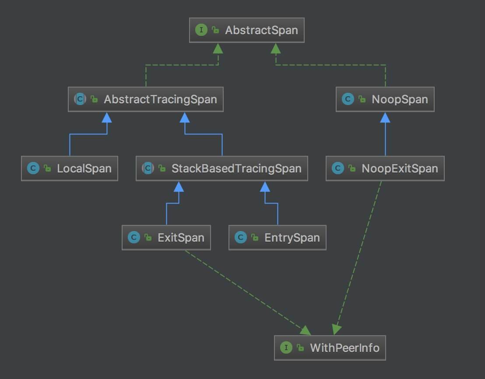

# SkyWalking数据模型

本部分主要介绍skywalking中的数据模型，其主要遵循OpenTracing语义标准，具体可以参考[《OpenTracing语义标准》](https://github.com/opentracing-contrib/opentracing-specification-zh/blob/master/specification.md)

skywalking的数据模型有三个重要的概念：

1. Trace
2. Span
3. Context

## Trace

### TraceSegment

TraceSegment是分布式链路追踪的一段，其具体实现类可以参考[TraceSegment.java](src/main/java/cn/mini/skywalking/trace/TraceSegment.java)：

- 一条TraceSegment，用于记录所在线程的链路
- 一条分布式链路可能包含多条TraceSegment，因此是跨进程（例如RPC、MQ等），跨线城（例如并发执行、异步回调等）

### Span

来自[《OpenTracing语义标准》](https://github.com/opentracing-contrib/opentracing-specification-zh/blob/master/specification.md)

> span，可以被翻译为跨度，可以被理解为一次方法调用, 一个程序块的调用, 或者一次RPC/数据库访问.只要是一个具有完整时间周期的程序访问，都可以被认为是一个span.

Skywalking定义了一个定义了一个接口，其并以了Span通用属性需要实现的方法，具体可以参考[AbstractSpan.java](src/main/java/cn/mini/skywalking/trace/AbstractSpan.java)

需要注意的是`AbstractSpan tag(AbstractTag<?> tag, String value)`方法可以将标签属性设置到Span上，为了统一tag的规范。OpenTracing同样具有相应的标准，具体可以参考[《opentracing-specification-zh —— 语义惯例》](https://github.com/opentracing-contrib/opentracing-specification-zh/blob/master/semantic_conventions.md#%E6%A0%87%E5%87%86%E7%9A%84span-tag-%E5%92%8C-log-field),
Skywalking对应的枚举类实现可以参考[Tags.java](src/main/java/cn/mini/skywalking/trace/tag/Tags.java)

Skywalking定义了多种span类来实现AbstractSpan接口，其类图具体可以参考如下：

抛开右半边Span实现类的特殊处理，Span的实现类主要有以下三种：

- EntrySpan: 入口Span
- LocalSpan: 本地Span
- ExitSpan: 出口span

AbstractTracingSpan的具体实现可以参考[AbstractTracingSpan.java](src/main/java/cn/mini/skywalking/trace/spanImpl/AbstractTracingSpan.java)

## Context

### ContextManager

ContextManager实现了BootService、TracingContextListener、IgnoreTracerContextListener接口，链路追踪上下文管理器

其中CONTEXT属于静态属性，线程变量，存储 AbstractTracerContext 对象

- 一个TraceSegment对象关联一个线程，负责收集该线程的链路追踪数据，因此使用线程变量
- 一个AbstractTracerContext会关联一个TraceSegment对象，Context负责获取、创建、销毁AbstractTracerContext对象

AbstractTracerContext为Skywalking定义的接口，主要有AbstractTracerContext和IgnoredTracerContext两个实现类，具体实现可以参考[AbstractTracerContext.java](src/main/java/cn/mini/skywalking/context/AbstractTracerContext.java)

